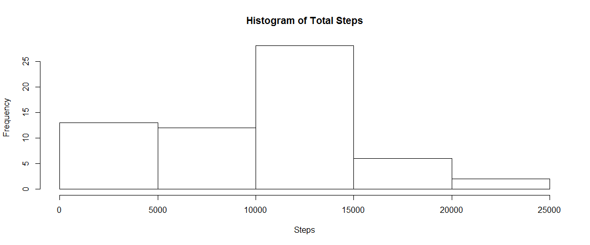
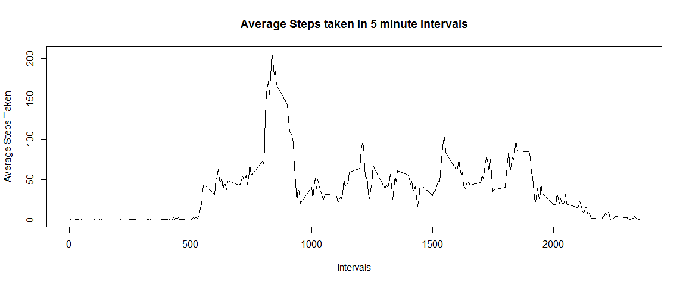
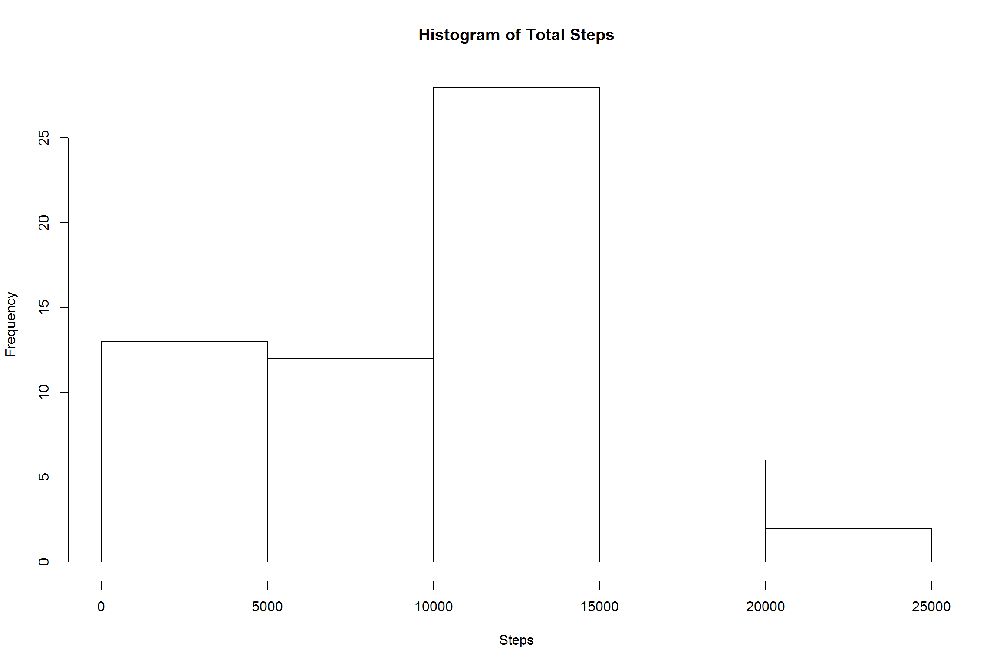
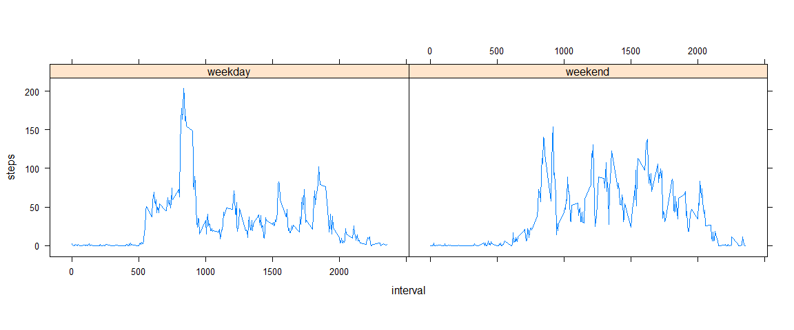

#RepData peer Assesssment 1


```r
knitr::opts_chunk$set(fig.width=12, fig.Aheight=8, fig.path='instructions_fig/',
                      echo=TRUE)
```

##Loading and preprocessing the data

-Load the data

```r
activity <- read.csv("activity.csv")
str(activity)
```

```
## 'data.frame':	17568 obs. of  3 variables:
##  $ steps   : int  NA NA NA NA NA NA NA NA NA NA ...
##  $ date    : Factor w/ 61 levels "2012-10-01","2012-10-02",..: 1 1 1 1 1 1 1 1 1 1 ...
##  $ interval: int  0 5 10 15 20 25 30 35 40 45 ...
```

-Pre process the data


```r
dailySteps <- with(activity, tapply(steps, date, sum, na.rm = TRUE))
```

##What is mean total number of steps taken per day?

-Plot a histogram of total steps


```r
hist(dailySteps, xlab = "Steps", main = "Histogram of Total Steps")
```

<!-- -->

-Mean and Median is calculated


```r
mean(dailySteps) #mean steps per day after ignoring missing values
```

```
## [1] 9354.23
```


```r
median(dailySteps) #median of steps per day after ignoring missing values
```

```
## [1] 10395
```


##What is the average daily activity pattern?

-Make a time series plot (i.e. type = "l") of the 5-minute interval (x-axis) and the average number of steps taken, averaged across all days (y-axis)


```r
intervalData <- with(activity, tapply(steps, interval, mean, na.rm = T))
plot(names(intervalData), intervalData, type = "l", xlab = "Intervals", ylab = "Average Steps Taken", 
     main = "Average Steps taken in 5 minute intervals")           ##Plot of Time Series
```

<!-- -->

-maximum number of steps in a 5-minute intervalis contained in


```r
intervalData[which.max(intervalData)]   #Interval where maximum steps taken
```

```
##      835 
## 206.1698
```

##Imputing missing values

-Total Number of missing values

```r
sum(is.na(activity$steps)) 
```

```
## [1] 2304
```

:Mean value for the particular minute interval is used to impute missing values

- A new dataset that is equal to the original dataset but with the missing data filled in is created

```r
imputedActivity <- activity

for(i in 1:nrow(activity)){
        if(is.na(imputedActivity[i,1])){
                imputedActivity[i,1] <- intervalData[names(intervalData) == activity[1,3]]
        }
}
```

- Make a histogram of the total number of steps taken each day and Calculate and report the mean and median total number of steps taken per day.


```r
imputedDailySteps <- with(imputedActivity, tapply(steps, date, sum, na.rm = TRUE))
hist(imputedDailySteps, xlab = "Steps", main = "Histogram of Total Steps")
```

<!-- -->


```r
mean(imputedDailySteps)
```

```
## [1] 9419.081
```


```r
median(imputedDailySteps)
```

```
## [1] 10395
```


:The mean value is the same as the value before imputing missing data because we put the mean value for that particular 5-min interval. 
The median value shows a little difference : but it depends on where the missing values are

##Are there differences in activity patterns between weekdays and weekends?


```r
imputedActivity$day=ifelse(as.POSIXlt(as.Date(imputedActivity$date))$wday%%6==0,
                          "weekend","weekday")
imputedActivity$day=factor(imputedActivity$day,levels=c("weekday","weekend"))
```
      :For Sunday and Saturday : weekend, Other days : weekday 
      

```r
weeklyData <- aggregate(steps~interval+day, imputedActivity, mean)
library(lattice)
xyplot(steps~interval|factor(day),data=weeklyData,aspect=1/2,type="l")
```

<!-- -->
